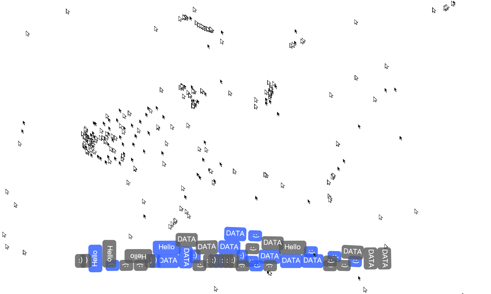

# JS Final Project - Socket.io Project
## Instruction
In this project, Users can interfere with the canvas of other users by creating new cursor flocks and text bubbles.<br>
Participants can interfere with each other. Their behaviors have a real-time influence on others. <br>

I want to simulate the chaos and interference of information overload. (How individuals influence each other’s<br> perception and behaviors in the age of data smog)

You can open multiple pages to experience this project. 

## How to start

```Bash
npm run devStart #type this code into terminal to run this project.
```
Then open - http://localhost:3000/

## Problem
- How can I display the latest message entered by the user without changing the message on the other box?
(Currently, I made an array to collect all the entered messages.  When user click the send button, it will dropped a box with a random message from the array. )


## Video

#### Iteration 1 
[](https://youtu.be/2RM8t_q-i24)

#### Iteration 2
